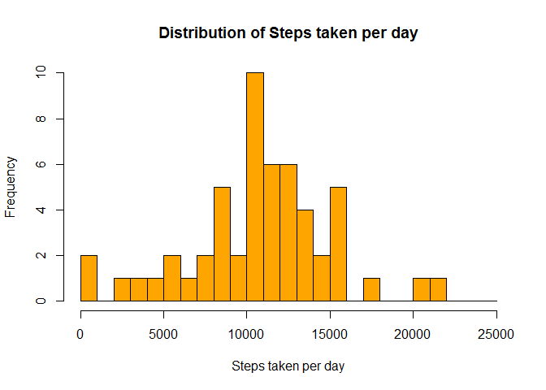
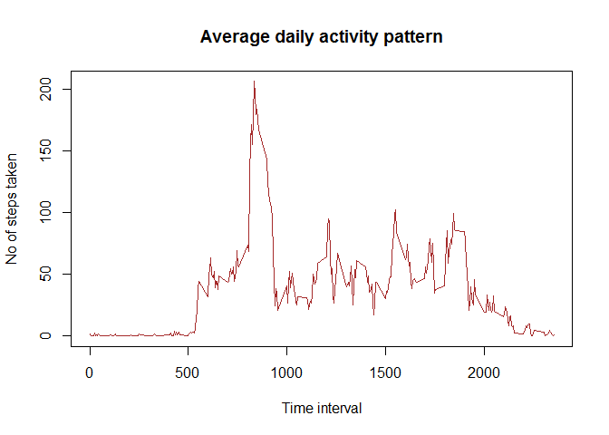
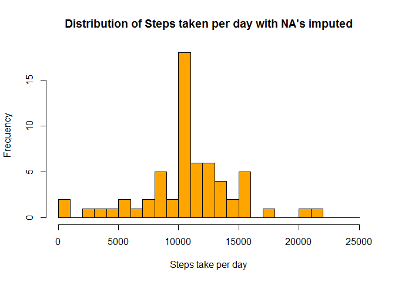
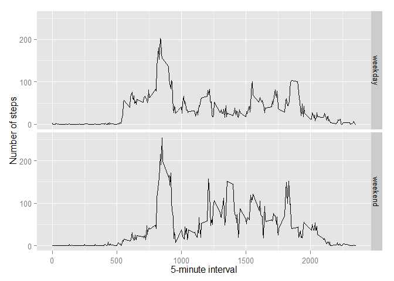

# Reproducible Research: Peer Assessment 1


## Loading and preprocessing the data


```r
library(data.table)
activityData <- read.csv("activity.csv")
populated <- read.csv("activity.csv")
naCases <- complete.cases(activityData)
cleanData <- activityData[naCases,]
```


## What is mean total number of steps taken per day?

```r
steps <-aggregate(cleanData$steps, list(date=cleanData$date),sum)
step_median <-median(steps$x,na.rm=TRUE)
step_mean <- mean(steps$x,na.rm=TRUE)
```
Mean total number steps per day = 1.0766189\times 10^{4}

Median of total number of steps per day = 10765

### Make a histogram of the total number of steps taken each day

```r
hist(steps$x,main="Distribution of Steps taken per day",
            xlab="Steps taken per day",col="orange",breaks=seq(0,25000,1000))
```

 

### What is the average daily activity pattern?


```r
steps_interval <- aggregate(cleanData$steps, list(interval=cleanData$interval),mean)
    plot(steps_interval$interval,steps_interval$x,xlab="Time interval",type="l"
         ,ylab="No of steps taken",lwd=1,col='brown',
         main="Average daily activity pattern")
```

 

#####Which 5-minute interval, on average across all the days in the dataset, contains the maximum number of steps?


The maximum steps taken is in the interval 835 and the max steps taken in this interval is 206.1698113

### Imputing missing values

#####Calculate and report the total number of missing values in the dataset (i.e. the total number of rows with NAs)

    The number of observations/rows having NA's are 2304

#####Imputing the missing values
    The stratergy used to for imputing the missing values is replace NA's with the mean of the interval across the activity dataset.


```r
    for(i in 1:length(activityData$steps)){
        if(is.na(activityData[i,1])){
            value <- steps_interval[activityData[i,3] == steps_interval$interval,2]
            populated[i,1] = value
        }
    }
    populated_steps <-aggregate(populated$steps, list(date=populated$date),sum)
```
    
#####Created Data set

```r
summary(populated)
```

```
##      steps                date          interval     
##  Min.   :  0.00   2012-10-01:  288   Min.   :   0.0  
##  1st Qu.:  0.00   2012-10-02:  288   1st Qu.: 588.8  
##  Median :  0.00   2012-10-03:  288   Median :1177.5  
##  Mean   : 37.38   2012-10-04:  288   Mean   :1177.5  
##  3rd Qu.: 27.00   2012-10-05:  288   3rd Qu.:1766.2  
##  Max.   :806.00   2012-10-06:  288   Max.   :2355.0  
##                   (Other)   :15840
```

#####Check for missing values in the new data set

```r
sum(is.na(populated$steps))
```

```
## [1] 0
```

###Make a histogram of the total number of steps taken each day with new data set

```r
    hist(populated_steps$x,main="Distribution of Steps taken per day with NA's imputed",
            xlab="Steps taken per day",col="orange",breaks=seq(0,25000,1000))
```

 

##### Calculate and report the mean and median


####Before Filling the data

Mean :

```
## [1] 10766.19
```

Median :

```
## [1] 10765
```


####After Filling the Data:

Mean:

```
## [1] 10766.19
```

Median:

```
## [1] 10766.19
```


There is no change in the mean's only there is a slight change in median's. We can conclude
that by populating the NA's with average of steps across the interval, only the increases the 
max values slightly


### Are there differences in activity patterns between weekdays and weekends?

####Calculating the aggregate of steps in weekdays and weekend

```r
    library(lubridate)
    populated$dayType <-0
   
    populated$date <- as.Date(populated$date)
    for(i in 1:length(populated$steps)){
    
        if(wday(populated$date[i]) %in% c(1,2,3,4,5)){
            populated$dayType[i]="weekday" 
        }
        else {
            populated$dayType[i]="weekend"
        }
    }
```


####Ploting the no of steps disbtribution between Weekdays and Weekends


```r
library(ggplot2) # we shall use ggplot2 for plotting figures
    averages <- aggregate(steps ~ interval + dayType, data=populated, mean)
    ggplot(averages, aes(interval, steps)) + geom_line() + facet_grid(dayType ~ .) +xlab("5-minute interval") +   ylab("Number of steps")
```

 

####Observation

The peaks for entire range of intervals go up for the weekend when compared to weekedays. On weekends we see a wider range of intervals having peaks greater than 100,activity spread over interval range is high.
